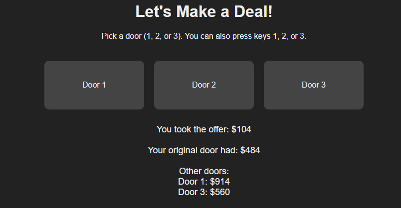

# Let's Make A Deal! - Simple Browser Game   

A minimal browser-based implementation of the classic
"Let's Make a Deal!" gameshow.  

## Tech Stack  

- HTML, CSS, Vanilla JS  

## Features  

- Minimalistic UI  
- Button-based interaction using JavaScript Event Listeners  
- Separation of game states and deterministic game logic  

## Sample Demonstration   

  
